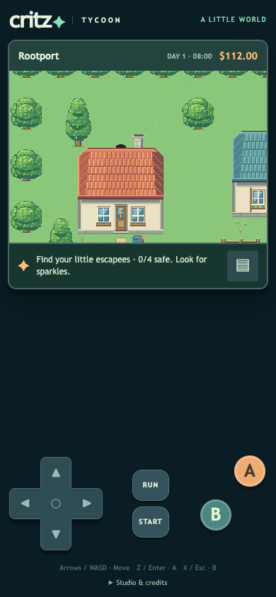
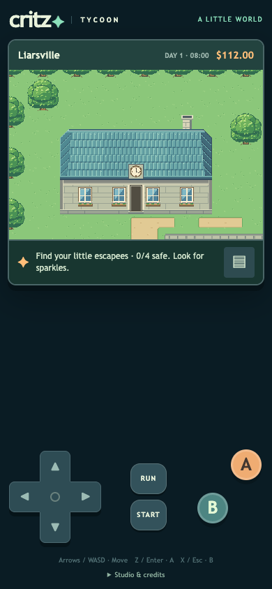

# M1.BH1 — Walking behind buildings

All twelve freestanding buildings now have reachable ground under their rear roof projection. Eleven allow one row; Old Waterworks allows two. Explicit rear-depth metadata separates roof extent from the solid footprint. The bottom walls remain blocked, and roofs plus chimneys draw over characters passing behind them. One cypress moves two cells east to clear the gardener cottage's rear corner. The cropped yard facade has its rear outside the map and remains an explicit boundary exception; the full home in Rootport has a walkable rear row.

The existing native art is unchanged. Doors, stairs, player names, story, economy, animal care and save keys are preserved. This is an original Critz implementation of the user's requested depth, not a new Emerald measurement.

## Verification

[104 unit checks](unit-results.txt) pass, including exact footprints, connected rear cells, solid remaining rows, attached chimney sorting and preservation of existing saved positions. [15 isolated browser checks](report.json) walk every rear strip with real movement input, verify blocked wall contact, compare [actual renderer occlusion pixels](occlusion.json), save/reload behind Waterworks and check runtime/assets. Synthetic saves use fresh isolated browser storage. Phone screenshots inspected; no physical Safari claim. Clean-release repetition and entrance regressions follow before publication.

## Publication

Pending clean-release checks and deployment. User traversal feedback remains pending; no full visual/movement approval is inferred.
