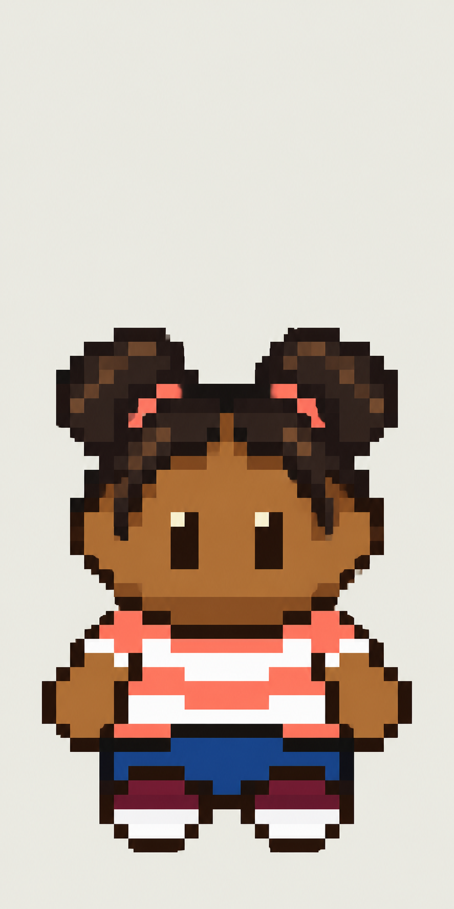

# M1.C4 revision 11 — Girl Hero concept

**Concept delivered; awaiting user visual review.** The user requested a girl concept using their newly edited boy and the Sprite Editor skeleton, with unchanged body proportions and hair extending above the skull. This is front idle only.

The proposal uses twin natural puffs with coral ties, short temple locks, a coral-and-cream shirt, blue shorts and burgundy/cream shoes. The supplied girl screenshot provides hairstyle/color direction; the supplied boy RLE takes priority for body construction. Art direction and construction rules are recorded in [ART_BIBLE](../../../ART_BIBLE.md).

## Sources and actual checks

- [Original boy RLE](user-boy.rle.json) is preserved verbatim. All 64 rows decode to 32 cells, with bounds `[3,25,29,62]`. [Native PNG](user-boy-native.png) and [16× view](user-boy-16x.png) decode those exact colors without smoothing.
- [Skeleton view](skeleton-16x.png) decodes the existing editor source at `docs/reviews/TOOLS-SE7/user-skeleton.pixels.json`. Its native frame is 32×64 and its bounds are `[3,26,29,62]`.
- Body/chin row envelopes from native row44 down match. Their occupied-cell masks differ at two hand/hip gap cells `(7,54)` and `(24,54)`. The boy's body alpha is symmetric and both feet end on row61, leaving two empty rows. These are source measurements, not measurements of generated output.
- The selected concept was visually inspected. It retains the broad compact body direction, fixed-size head direction and separate elevated puffs. Its actual file is **887×1774**, a generated enlarged concept with fine edge/color variation, **not a verified 32×64 sprite**, exact enlargement, editor project or pixel-locked body mask.
- PNG chunk CRCs, dimensions and source hashes are recorded in [source-measurements.json](source-measurements.json). No runtime tests apply because game code/assets were not changed.

Built-in `image_gen` generated the concept from the decoded references and [attached girl screenshot](user-girl-design-reference.png). [Exact prompts](PROMPTS.md) record both calls. The initial generated grid plate was not selected because its grid/registration was unreliable; no generated labels are treated as measurement evidence. The clean refinement is the selected concept preview. A countable native grid and pixel-exact anatomy verification remain required for any subsequent production sprite.

## Review boundary

No user approval is inferred. No animation, gameplay replacement, renderer, collision or save changes. This packet is review documentation only; the playable build is unchanged and needs no deployment. Next action: user reviews the girl design; any later native sprite must preserve the supplied boy's actual body cells and skeleton landmarks, checked independently from hair.

Work began directly on `main` at `651f3601c33e1a2584fab796a92cd6257d09049b`. Unrelated unfinished project edits are preserved and excluded. Commit/push verification is recorded in PROJECT_STATUS.
