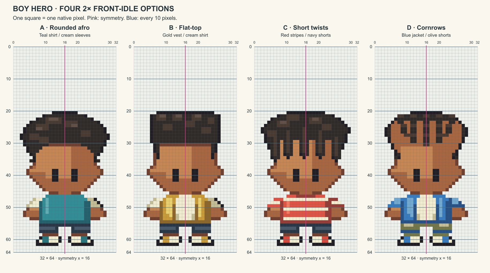

# M1.C4 revision 4 — Four front-idle Hero options

**Awaiting user art review.** Revision 3 was rejected as elf-like. The user requested four 2× options following the supplied four-concept image, each on the grid with a symmetry line. This request uses four 2× figures only; prior 1× studies remain available in history.

[Large 2×2 grid](four-heroes-grid-2x2.png) · [Measurements/deviations](MEASUREMENTS.md) · [Validation](validation.json)

| Option | Reference-led appearance | Native / large grid |
| --- | --- | --- |
| A | Rounded afro, teal shirt, cream sleeves, navy shorts | [PNG](a-afro.png) / [grid](a-afro-grid.png) |
| B | Flat-top, gold vest, cream shirt, dark shorts | [PNG](b-flat-top.png) / [grid](b-flat-top-grid.png) |
| C | Short twists, red/cream stripes, navy shorts | [PNG](c-twists.png) / [grid](c-twists-grid.png) |
| D | Cornrows, blue jacket, cream shirt, olive shorts | [PNG](d-cornrows.png) / [grid](d-cornrows-grid.png) |

Each native file is 32×64 RGBA with binary alpha. Each review cell is exactly 12×12 display pixels, represents one native pixel, and is drawn from the same indexed rows as the PNG. The vertical pink centerline is x=16; horizontal blue guides are numbered 0/10/20/30/40/50/60/64. Grids are overlays, never embedded in the native PNG. The full transparent frame is deliberately visible.

## Correction and design status

The previous wide ears and narrowing lower face read as an elf. These options use short, blunt ear tabs, fuller cheek planes and a compact jaw. Hair, clothing and grouped light/shadow distinguish all four variants. Skin, eyes, torso, arms, hands and legs retain a mirrored anatomical scaffold; hair and color are independent. Outlines use material colors and dark contact edges, with individual target-pixel contour steps.

Exact source target deviations are documented, particularly the narrower face/ears and flatter hair profiles. These are candidate adaptations to the latest visual references, not a silent replacement of the standing Emerald contract or an assertion of exact equivalence. No final Hero design is accepted until the user reviews it.

## Method and actual checks

Original indexed sources extend the project’s existing code-native editable sprite workflow in `build.mjs`; adjacent JSON files store rows, palette, part masks and the hidden symmetric skull scaffold. No reference bitmap is resampled; no image-generation tool or new image-generation prompt was used for this native-source pass. Rebuild with Node and `CODEX_PRIMARY_RUNTIME_NODE_MODULES` pointing to modules containing `sharp`; run `verify.py` with Pillow.

Independent decoding checks pass for 8,192 native cells and 16,384 grid cells across the two combined plates. All four PNGs have binary alpha, one connected silhouette, at most 15 colors, exact eye landmarks, paired anatomy and actual one-target-pixel silhouette refinements. Both combined sheets were visually inspected. Checks establish pixel integrity, not art approval. The individual grids share the same rendering function.

No walking, back view, runtime integration, renderer changes, save access or deployment. These review artifacts live under documentation and are not consumed by the game. The exact next action is user selection/refinement of the four idle candidates before any animation.
