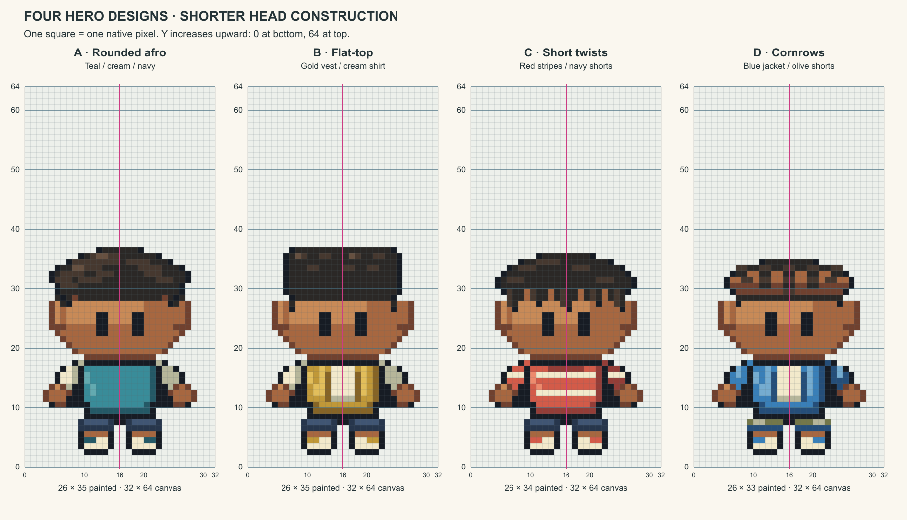

# M1.C4 revision 6 — Shorter original heads, full upward-counting grids

**Delivered for user review; no final art acceptance.** The user identified the incorrect assumption that original hair/skulls should reach the top of Brendan's headwear, requested four redraws retaining the supplied designs, and asked to centralize art direction in ART_BIBLE. The user then clarified that the earlier “36 pixels” estimate came from counting upward on a downward-numbered grid and explicitly requested **0 at the bottom**. No fixed 36px skull/figure requirement is inferred.

[Large 2×2 grid](four-heroes-grid-2x2.png) · [Clean inspection](clean-check.png) · [Measurements](MEASUREMENTS.md) · [Validation](validation.json)

[Brendan beside all four, full grids with Y upward](/Users/tanoshi/.codex/visualizations/2026/10/03/hero-revision-6/brendan-and-four-grid.png) is a local reference-only artifact outside the build. Its machine-specific link does not ship reference pixels.

| Candidate | Retained character design | Painted size | Native / individual grid |
| --- | --- | --- | --- |
| A | Rounded afro, teal shirt, cream sleeves, navy shorts, teal/cream shoes | 26×35 | [PNG](a-afro.png) / [grid](a-afro-grid.png) |
| B | Flat-top, gold vest over cream shirt, dark shorts, gold/cream shoes | 26×35 | [PNG](b-flat-top.png) / [grid](b-flat-top-grid.png) |
| C | Short twists, red/cream striped shirt, navy shorts, red/cream shoes | 26×34 | [PNG](c-twists.png) / [grid](c-twists-grid.png) |
| D | Cornrows, blue jacket over cream shirt, olive shorts, blue/cream shoes | 26×33 | [PNG](d-cornrows.png) / [grid](d-cornrows-grid.png) |

Every PNG has a full 32×64 transparent frame and anchor (16,64) in native coordinates. The grids show every row, one native pixel per cell, enlarged exactly 12×. The bottom border is Y=0, top border Y=64, with major lines at 0/10/20/30/40/50/60/64 and vertical symmetry at x=16. PNG rows continue downward internally; labeling changes do not flip the artwork. The last foot row is 61, occupying displayed heights 2–3.

## What changed

The former 42px full-height requirement is removed. Hair crowns now begin at native rows 27/27/28/29 instead of row 20; these are original hairstyle choices, not a recovered skull measurement. Face baseline, paired eyes, jaw/neck and feet remain aligned with the supplied Brendan comparison. Short twists overlap the face baseline locally without displacing the eyes. The hidden skull scaffold is shared and symmetric; hair remains a separate overlay. Small ear tabs, fuller cheek steps, narrower garment planes and dark sleeve/body overlaps replace the tall forehead and broad flat shirt construction. Original identity, clothing colors and hairstyle distinctions remain.

This is original native pixel authoring through the existing editable source workflow, not a resized concept bitmap or a recolored Brendan sprite. No new image-generation tool call/prompt was used. This native-source revision retains the R4 character color families. The concurrent Wildlife palette change is scoped to the Sprite Editor workflow and preserves legacy project pixels; no editor import or automatic palette conversion is performed here. `build.mjs` exports indexed JSON, transparent PNGs and exact grid artwork. `verify.py` independently decodes PNGs and checks source equality, anatomy and grid coordinates.

## Direction cleanup

AGENTS.md now points to ART_BIBLE for art direction and contains no duplicated numerical art specification or head/hair envelope assumptions. General project workflow, authorization, save protection and review gates remain. ART_BIBLE corrects the misleading current clauses, records the hat/skull and coordinate mistakes, establishes upward-counting full-grid presentation, distinguishes historical evidence from current direction, and preserves the no-reference-art integration boundary. The reusable new-task prompt also defers to ART_BIBLE instead of repeating stale specifications.

## Actual verification and limits

Passed: 8,192 native PNG/source comparisons; 8,192 anatomical-mask comparisons; 34,816 grid-center comparisons including four individual grids, both combined layouts and the external Brendan comparison. All four have binary alpha, one connected silhouette, <=15 colors, exact eye masks, anchored feet and single-target-pixel contours. Grid labels/major-line coordinates and x=16 centerlines are checked. AGENTS contains a direction pointer and no duplicated numeric art rules. Combined/full/individual rendering and the clean/reference inspection were visually reviewed. Tests verify construction and integrity, not whether the style is accepted.

The supplied refined Brendan version is distinct from pinned ROM-source measurements; hidden skull and exact bone shapes remain unobservable. No back pose, animation, gameplay replacement, save access or runtime migration. Review/source documentation changes do not alter the playable build and need no deployment. Exact next action: user reviews the four idle candidates and the corrected coordinate convention before more art or walking.
