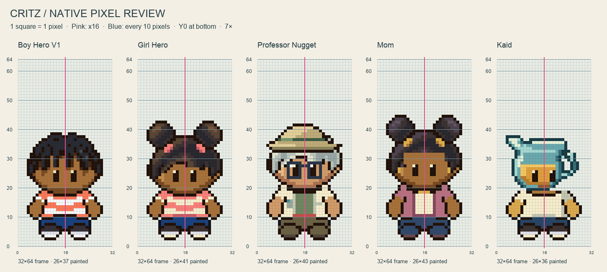
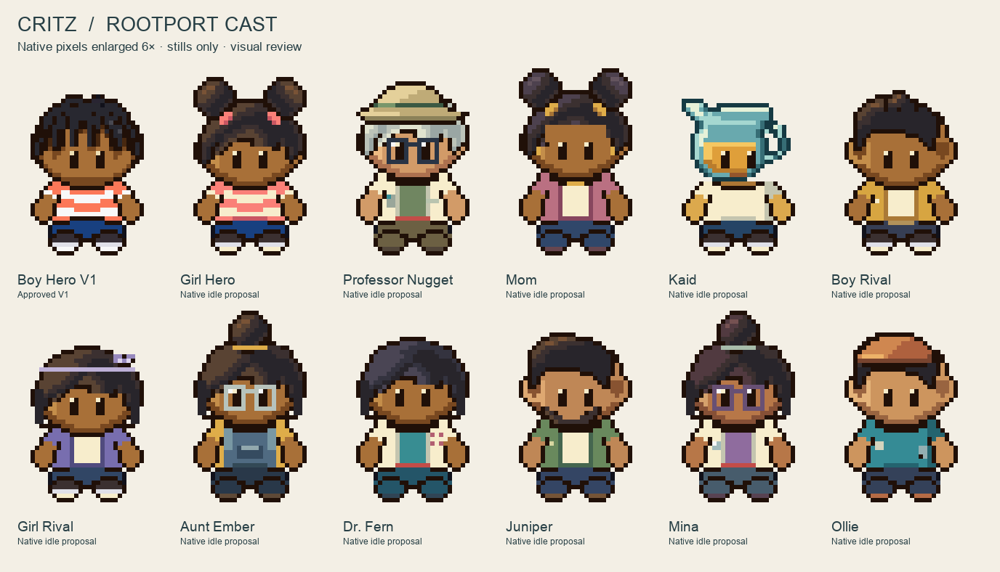
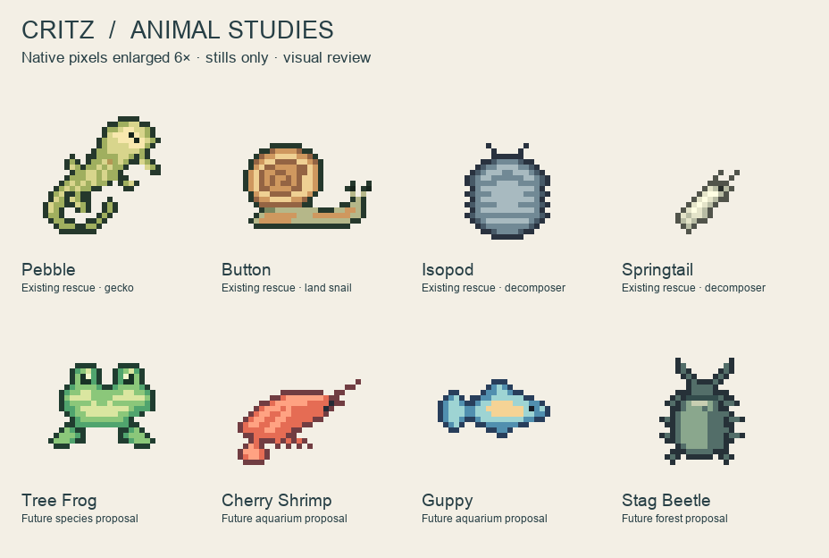

# M1.C6 — Rootport idle collection

**Nineteen new native stills delivered; awaiting user visual acceptance.** The user explicitly requested Girl Hero, Professor Nugget, Mom, Kaid, additional characters and animals, selected the prior girl concept, and deferred animation. Boy Hero V1 is included only as the unchanged approved scale reference.

## Files

- [Complete download pack](critz-idle-collection-v1.zip): individual transparent PNGs, indexed Sprite Editor projects, exact RLE exports, native sheets, manifests, construction masks, generation/verification scripts and all review plates.
- [Native character sheet, 384×64](characters-native.png) · [Native animal sheet, 256×32](animals-native.png).
- [Additional cast grid A](cast-grid-a.png) · [Additional cast grid B](cast-grid-b.png) · [Animal grids](animals-grid.png).
- [Asset manifest](../../../assets/review/idle-collection-v1/manifest.json) · [Validation results](validation.json).

Open any `*.sprite.json` or `*.rle.json` from `art/source/idle-collection-v1/` in the existing Sprite Editor. Each contains one native still, its exact custom RGB palette and no baked-in guide pixels. No animation is supplied. Native PNGs are under `assets/review/idle-collection-v1/`; their review location is intentional. None replaces accepted gameplay artwork.

## Cast

| New sprite | Design retained / purpose |
| --- | --- |
| Girl Hero | Black child; twin puffs/coral ties; coral and cream shirt, blue shorts, burgundy shoes; approved boy's body footprint |
| Professor Nugget | Adult herpetologist; field hat, silver hair, glasses, cream field coat and sage shirt |
| Mom | Adult; swept natural hair with paired puffs, gold earrings, rose cardigan, cream top, navy trousers |
| Kaid | Original teal glass pitcher child; amber contents, spout left, hollow handle right, cream shirt |
| Boy Rival | Player-named child option; short swept curls, gold jacket, cream shirt |
| Girl Rival | Player-named child option; side-swept bob, lilac hairband/jacket |
| Aunt Ember | Existing adult glass artist; protective glasses, tied-up hair, gold sleeves, slate apron |
| Dr. Fern | Existing Vet character; bob, cream coat, teal scrubs, badge |
| Juniper | Existing Critz shopkeeper; cropped curls, beard, green overshirt |
| Mina | Existing pharmacist; bun, glasses, cream coat and lavender shirt |
| Ollie | Existing Bike Shop mechanic; orange cap, teal shirt, work trousers |

These are appearance proposals for established roles, not character renames or new plot decisions. Rival options remain player-named; no gender or personality is imposed by an accessory.

Pebble the gecko, Button the land snail, isopod and springtail studies cover the existing rescue groups. Tree frog, cherry shrimp, guppy and stag beetle are **future-species visual proposals**. Small organisms are drawn at an observation scale to make their shapes readable; the sheet is not a shared biological size scale. No species availability, housing compatibility, breeding or care system is added.

## Construction measurements

Native coordinates run downward; review Y labels run upward. Bounds below are half-open. Full 32×64 canvases, two empty bottom rows and anchor `(16,64)` are retained for every character. The chosen body is user-approved Critz art; it supersedes previous assistant anatomy guesses.

| Feature | Existing pinned Emerald evidence | Linear 2× target | This collection |
| --- | --- | --- | --- |
| Human canvas | 16×32 | 32×64 | All 11 new characters: 32×64 |
| Ground anchor | (8,32) | (16,64) | (16,64), independent of painted bounds |
| Final idle foot row | 30 | 60–61 | Final row61; rows62–63 empty |
| Brendan eyes | x6/x9, y19–20, 1×2 each | x12–13/x18–19, y38–41, 2×4 | Child eyes match; adult eyes shifted up2 as a documented original adaptation |
| Full Brendan extent incl. cap | 14×21 | 28×42 | Approved Boy V1:26×37; not a required skull/hair height |
| Mom/Birch full extents | 16×20 | 32×40 | New adults retain 32×64 storage and compact limbs; full extents vary with hair/hat |
| Hidden skull | Not measurable beneath headwear | Unresolved in reference | User skeleton supplies symmetric original construction |

Pinned source revision: `pret/pokeemerald@5eff78649e7170a877b961ef0b3da13b81a16038`. This reuses [existing reference measurements](../../REFERENCE_MEASUREMENTS.md) and [Brendan frame0 eye annotations](../M1-C4/revision-2/MEASUREMENTS.md), not new emulator observations or new per-adult bone measurements. Exact existing baseline: [Hero Boy V1](../../../art/source/hero-boy-v1/idle.sprite.json). Girl concept: [selected R11 image](../M1-C4/revision-11/girl-hero-concept.png). Existing supporting costumes were inspected in [the earlier supporting study](../M1-I2/supporting-character-study.png); its old dimensions do not control this production.

| Core sprite | Native painted bounds | Painted extent | Departure from approved boy |
| --- | --- | --- | --- |
| Approved Boy V1 | [3,25,29,62] | 26×37 | Exact original, not modified |
| Girl Hero | [3,21,29,62] | 26×41 | Puffs extend4px above boy hair; body alpha unchanged from row45 |
| Professor Nugget | [3,22,29,62] | 26×40 | Original hat/gray hair; eyes2px up; torso2px taller upward |
| Mom | [3,19,29,62] | 26×43 | Puffs above skull; eyes2px up; torso2px taller upward |
| Kaid | [3,26,29,62] | 26×36 | Original vessel adaptation; only spout/handle exempt from bilateral anatomy |

Individual actual bounds, palette counts, anchors, source paths and PNG/RGBA hashes are in the manifest. Animal frame32×32 is a Critz study choice; no Emerald species geometry is claimed.

## Checks and visual inspection

All nineteen PNGs match their editable indexed source and expanded RLE byte-for-byte in RGBA. Dimensions, binary alpha, occupied bounds and hashes pass. All eleven characters have symmetric authored body, arms, hands, legs and eye masks; humans also have symmetric underlying skull masks. Hair/color and Kaid's vessel are separately identified. The girl has zero changed body-alpha cells from row45 onward. V1's original source and PNG SHA-256 hashes remain unchanged.

Visible eyes were checked after hair/accessories, not only on hidden masks. An initial fringe obscured one eye and was corrected before delivery. Adults received full trouser colors/simple shoes without lengthening their lower limbs. Pebble's four splayed limbs were checked in the clean enlargement. Hair remains solid dark material where appropriate; contours use individual cells rather than a forced 2×2 grid. These checks document construction, not proof that the user will like the artwork.

Native sheets and clean6×/gridded7× plates were inspected. Character clean sheets crop only the identical unused top18 rows for page layout; exported sprites and grid plates retain the full64 rows. Grid overlays use x16 and Y0-at-bottom, with labeled10-row guides. No reference-game raster is included.

Rebuild using bundled Node with Sharp available through `CODEX_PRIMARY_RUNTIME_NODE_MODULES`: `node art/source/idle-collection-v1/build.mjs`. Then run `python3 docs/reviews/M1-C6/verify-and-present.py` with Pillow. Native assets use authored integer cells; the Python script renders review overlays and verifies exports.

Work started on `main` at `20f7c8de6ab436b77e1e583a67bc9c6a21d977b2`. Existing unfinished gameplay/walking changes are excluded. This is a review-asset/documentation change; **playable build unchanged**, no deployment needed. No save, collision, renderer, story, map or world changes. Commit/push evidence is recorded in PROJECT_STATUS. Exact next action: user reviews these native stills before further refinement, animation or runtime integration.
