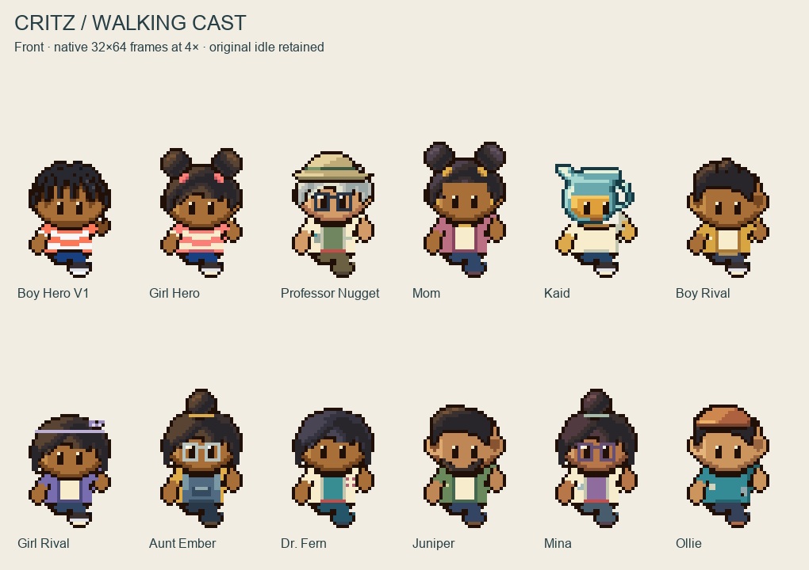
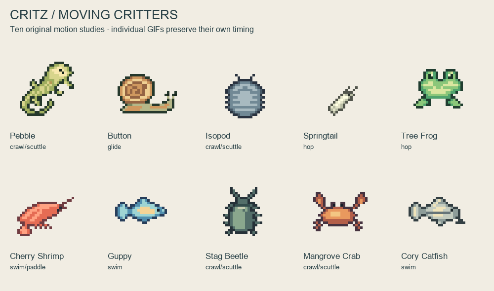
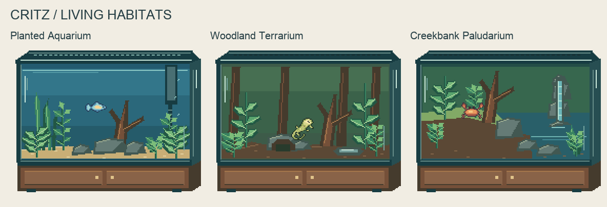

# M1.C7 — Walking cast, moving critters and living habitats

**Assets/checks complete; new motion, views and habitats await user visual review.** The user requested animation of the M1.C6 collection, three habitat types and additional critters. Deliverables: twelve characters, ten moving critters, three animated close-ups and three world props. No gameplay integration is implied.

[Watch four-direction walks](characters-four-directions.gif) · [Direction contact sheet](directions-poster.png) · [Countable core walk grid](core-walk-grid.png)

## Download

[Complete asset pack](critz-motion-habitats-v1.zip) · [Validation](validation.json) · [Manifest](../../../assets/review/living-collection-v1/manifest.json).

Every character's folder under `assets/review/living-collection-v1/<slug>/` contains native 32×64 `south.gif`, `north.gif`, `west.gif`, `east.gif`, a 16-frame `motion.gif`, 128×256 `sheet.png`, individual PNGs and a manifest. Sheet rows are south/north/west/east; columns are strideA/passing/strideB/passing. Editor projects and exact RLE are under `art/source/living-collection-v1/`. Each opens in the existing Sprite Editor.

Characters: Boy Hero V1, Girl Hero, Professor Nugget, Mom, Kaid, Boy Rival, Girl Rival, Aunt Ember, Dr. Fern, Juniper, Mina and Ollie. All original front passing poses remain exact, and the complete existing Boy V1 front walk is reused unchanged. Back/profile drawings are new original proposals. Kaid's profiles are separately authored, with distinct physical handle/spout relationships.

Critters each have a native 32×32 four-pose GIF, 128×32 sheet, PNGs, metadata and editable sources. Existing idles remain exact in frame0: Pebble, Button, isopod, springtail, tree frog, cherry shrimp, guppy and stag beetle. New still/motion proposals add **Mangrove Crab** and **Cory Catfish**. The crab name labels a stylized art study, not a precise species identification. [All critter poses](critter-poses.png).

Each habitat directory (`aquarium`, `terrarium`, `paludarium`) includes a 192×144 sixteen-frame close-up, native GIF/sheet, `back.png`, `foreground.png`, and a separately authored 96×96 `world-prop.png`. Layers/props also have editable projects. [World props](world-props.png). These are original Critz art dimensions, not measured Emerald tank dimensions or gallon ratings.

## Motion and habitat decisions

Characters use strideA → passing → strideB → passing, 8 ticks each, with2px stride bob, foot row 61 passing /63 stride and anchor (16,64). Tick length is 280896/16777216 seconds, reusing [the pinned Emerald source cadence](../../REFERENCE_MEASUREMENTS.md). Per-direction GIF holds 130/140/130/140ms total 540ms versus 535.7666ms source duration. The new side/back poses are authored Critz geometry, not new pixel-exact reference measurements. No emulator/camera or gameplay-motion observation is claimed.

Critters use original stylized crawl/scuttle, glide, hop, swim and paddle motions. Snail holds 18 ticks per pose, springtail 12/4/8/6, frog 14/6/10/8, others 8 each. Native metadata preserves exact timing; the overview gallery synchronizes poses for display, with a slower snail. Individual GIFs retain their own timing. Observation-scale depictions do not imply common physical sizes.

- **Aquarium:** underwater planting, sand, driftwood, rocks, filter/intake and bubbles; guppy demonstration.
- **Terrarium:** dry substrate, cork/wood, planting, hide, perch, shallow dish and vented top; Pebble demonstration.
- **Paludarium:** retained land, sloping shore, pool, planting and waterfall; crab demonstration.

One species is featured per scene. These are art demonstrations, not care, salinity, stocking or compatibility recommendations. The25-gallon gift, safe rescue housing and ecosystem rules remain unchanged. No animals are moved into the playable tank by this delivery.

## Verification and limits

Verified **1,761,280 PNG cells and 1,761,280 decoded native GIF cells** against indexed source/RLE. Dimensions, binary alpha, colors, hashes, loop flags, frame counts and delays pass. Every character/critter pose is one 8-connected silhouette. All front idles remain exact; each directional cycle has distinct opposing strides and exact passing-pose returns. Character foot contacts and Kaid's non-mirrored profiles pass. World props match their editable files.

Inspected native/enlarged poses, all directional idles, core strides, every critter pose, habitat scenes and countable grids. Initial narrow side bodies, neck gaps, lost outer-garment colors and detached animal joints were corrected before delivery. Gallery GIFs may use a reduced presentation palette; native GIFs are independently verified pixel-exact and remain authoritative. Technical checks do not self-approve appearance or movement.

Rebuild in this repository: `node art/source/living-collection-v1/build.mjs` with Sharp available through `CODEX_PRIMARY_RUNTIME_NODE_MODULES`; then `python3 docs/reviews/M1-C7/verify-and-present.py` with Pillow. The source depends on existing M1.C6/Boy V1 files. No screenshot resampling or generated overlays create production pixels.

Started directly on `main` at `4aec0c8cb8c72d53537f606216710b6ef223f6d9`. Concurrent completed overworld/music work and unfinished game/walking edits are preserved. **Playable build unchanged by this task; no deployment required.** No renderer, collision, save, scene, habitat simulation or live-atlas replacement. Commit/push evidence is recorded in PROJECT_STATUS. Next action: user reviews motion/habitat appearance before changes or accepted runtime integration.
