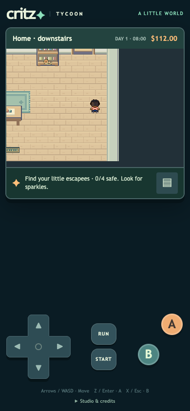
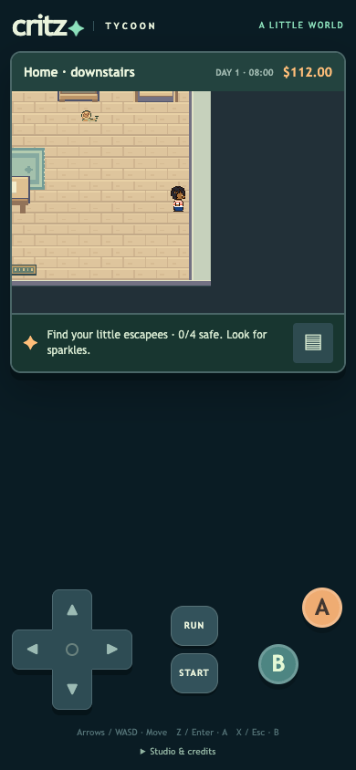
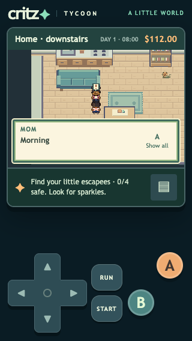
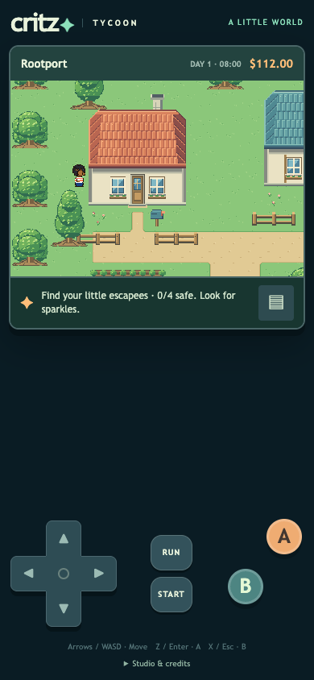
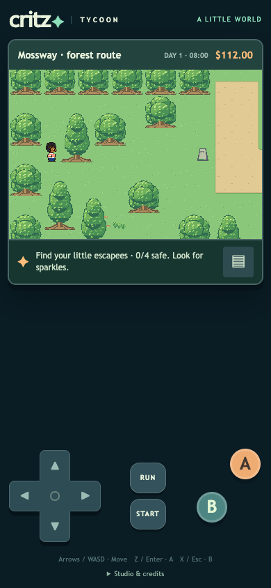

# M1.CF1 — Stable speech and closer, readable contact

Talking no longer changes the camera target. The old phone layout switched camera Y from 48 to 97 when Mom spoke, a 49-native-pixel jump. The corrected sample stays at Y80 throughout; the different baseline reflects the corrected indoor actor anchor. The two-line fast dialogue overlay fits above the controls and below the hero at tested viewports, with a 44px confirmation target.

Interior characters previously stood at the top-left corner of their collision cell while outdoor characters used the bottom center. Both now use the same bottom-center anchor. This removes 16 native pixels of unnecessary space at the right wall and resolves the opposite-side overlap. NPCs, rescues, scripted actors, stairs and floor thresholds follow the same convention. Saved coordinates and collision footprints remain unchanged. Releasing a blocked direction now stops the shuffle on the next simulation tick, while ordinary committed steps still finish. This responsiveness change is an original Critz decision.

## Native tiles

The master PNG now contains 639 named tiles. All 588 previously published tile images and coordinates remain exact. There are 51 new tiles: 42 reusable plaster/timber/stone/window/door foundation variants for grass, path and paving; four root pieces shared beneath retained broadleaf/cypress canopies; and five interior baseboard, side and south-edge pieces. Foundations include actual ground within the solid base cell, as requested. Trees retain their two-cell footprint but visibly occupy it with roots. Solid surrounding walls, one/two-row rear-building overlap and automatic door travel remain.

[Pixel/anchor evidence](art-check.json) · [Authoring source](../../../art/source/overworld-live/build.mjs) · [Master PNG](../../../assets/playable/overworld/master.png). These are original Critz refinements, not new Emerald measurements or self-approved artwork.

## Checks and review

Local checks pass: [108 unit tests](unit-results.txt), [17 dialogue/contact browser scenarios](report.json), and [eight UI regressions](ui-report.json). Camera coordinates and canvas bounds stay fixed across opening, typing, all pages and closing for indoor/outdoor conversations at 320×568, 390×844, 844×390 and 1280×900. Movement tests cover all four room edges, furniture, building side and tree roots; blocked input release and synthetic save/reload preserve cell, money, debt and 25-gallon gift. Tests use fresh isolated browser contexts, never user storage. Native source pixels, all map references, collision connectivity and binary alpha pass. Clean-release repetition and full doorway/story regressions follow before publication. No physical Safari testing is claimed.

Before / after right-wall contact:

## Publication

Pending clean-release verification and deployment. User visual/contact feedback is the next review gate; no broad art or movement approval is inferred.
