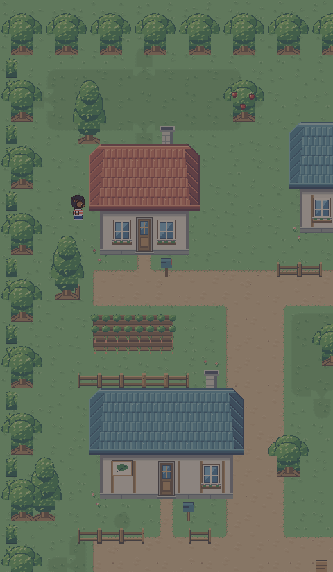
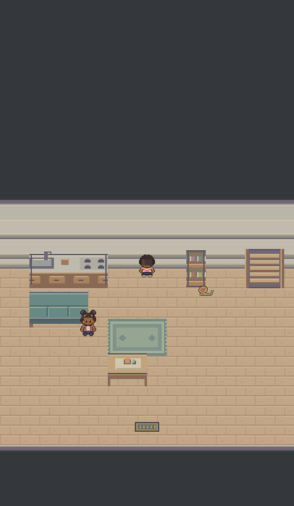
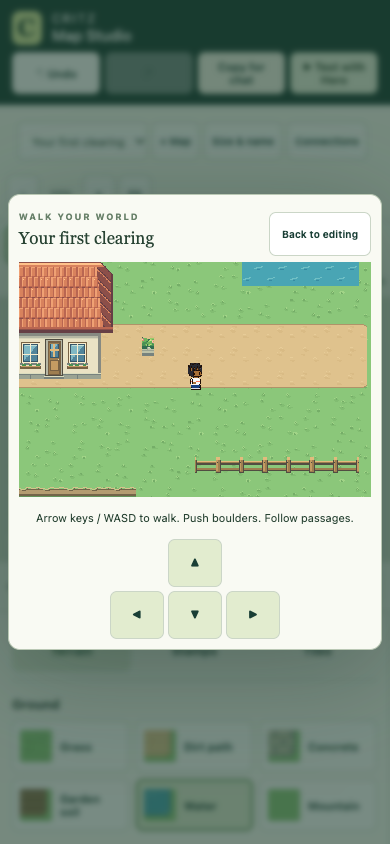
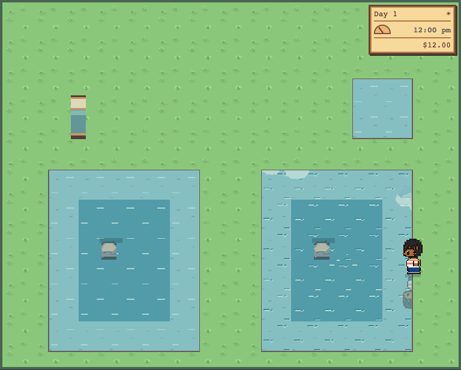

# M1.CT4 — Approved B contact

User approval: “The answer is B, B is perfect for us” (2026-10-10), with authorization for every building/barrier and both boundary axes. Canonical specifications remain in [ART_BIBLE](../../ART_BIBLE.md#transition-tile-contact-study--m1ct1-user-correction). B is the approved Critz decision; this is not an Emerald measurement or broader character/world approval.

The shared native method now covers every static overworld collision assembly, water, Map Studio stamps/fences/cliffs/directional ledges, indoor walls/furniture/stairs and greenhouse facades/walls/tubs/equipment. The bank contains1,798 assemblies and5,247 named native32px tiles, plus Tiled metadata. Exposed invisible map boundaries are represented by145 matching hedge contact cells. North/south planes use approved foot registration; exposed multi-cell sides use half-cell returns. Corners/caps keep native silhouette and connected fence runs remain connected. Roofs/canopies remain overhead projection, separate from solid ground footprint.

The editor offers an Approved B contact tilesheet, semantic whole-building stamps and copied rule metadata. Transparent contact portions use the actual grass/path/paving/floor underneath. Dynamic fish, fountain spray, ripe fruit and wheel variants follow translated structures. Historical source atlases remain editable inputs; named tiles and shared cached runtime conversions are the active rule.

Clean task-only export passes192 unit tests and271 isolated browser checks:140 actual-game collision approaches,17 contact/dialogue checks,22 editor checks,16 greenhouse checks,28 door transitions,11 water checks,8 depth checks,14 clock/sleep checks and15 lab checks. Native screenshots were inspected. Atlas alpha is binary and every named tile remains32×32 on the native grid; see [checks](checks.json) and individual browser reports. A water test helper was corrected to release a held key when the committed step begins, avoiding accidental second steps under browser load; gameplay movement was unchanged.

Every building and representative static collider families are approached from reachable sides using actual input and synthetic saves. Whole collision cells, actor anchors, passage coordinates, v1 keys and save data remain unchanged. Doors/stairs, one-way ledges, movable boulders, walkable shallows, greenhouse payment/catching, clock/sleep and reload regression checks pass. Browser phone layouts pass; physical Safari and haptic hardware remain untested. Wider M1/M2 review gates remain with the user.

Published as Sites version40 from main source `9799c6f76e76d2cdb432f7211da0713dd2f22574`; deployment succeeded2026-10-10 6:35:49PM Pacific. All910 tested runtime files match the release and all2,084 build files match the archive. Owner-private audience and existing saves preserved. [Deployment receipt](deployment.json) · [Archive proof](archive-check.json) · [Version provenance](version.json). Final receipt updates are documentation only. Unrelated character/coast edits remain in the shared workspace. Exact next action: try integrated B in adventure/Map Studio; no CT4 implementation/publication work remains. [Adventure](https://critz-tycoon.freemarketwildlife.chatgpt.site/) · [Map Studio](https://critz-tycoon.freemarketwildlife.chatgpt.site/map-editor/) · [Historical lab, B approved](https://critz-tycoon.freemarketwildlife.chatgpt.site/art-review/contact-lab/).

