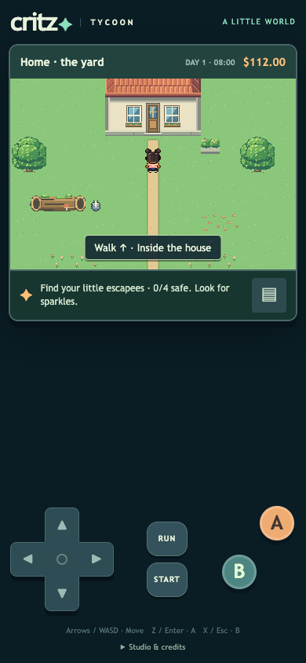
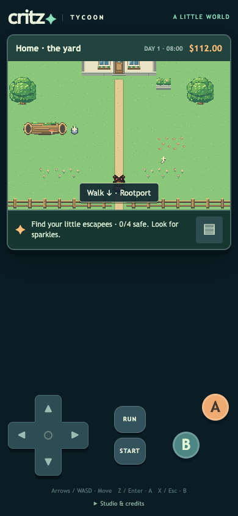

# M1.DO1 — Walk through every entrance

The user wants door travel by walking, without selecting an option or pressing A. Automatic entry already existed, but two home-yard thresholds were unreachable: the house door at `(8,3)` fell above the yard’s permitted walking row, and the gate at `(8,11)` was removed by the connected-floor boundary pass. Both are now explicitly authored portals. Only those cells open; adjoining walls, fences and out-of-map positions remain blocked.

All 26 live entrances now declare an entry direction. Completing the entrance step automatically travels; sideways storefront movement does not. Door prompts read “Walk ↑/↓ · destination” instead of presenting an A action. Town-guide instructions use walking throughout. The optional existing A shortcut remains for compatibility; no door requires it. Arrival positions, saves, story restrictions, stairs, names and care/economy behavior remain intact.

## Reference and decisions

Pinned `pret/pokeemerald` revision `5eff78649e7170a877b961ef0b3da13b81a16038`: [field input processing](https://github.com/pret/pokeemerald/blob/5eff78649e7170a877b961ef0b3da13b81a16038/src/field_control_avatar.c#L145-L180) distinguishes step/held-direction warp handling from A interactions. This is source inspection, not emulator observation. Critz retains its completed-step fade, original art and optional shortcut; exact Emerald door-animation reproduction is not claimed.

## Checks

[101 unit checks](unit-results.txt) pass, including every entrance’s walkable approach, complete step and safe arrival; all directions; exact yard boundary exceptions; and existing story, save, collision and stair checks.

[28 isolated browser scenarios](report.json) cover all 26 entrances with movement only, no A or confirmation. Both previously blocked yard portals use real touch D-pad input; other entrances use keyboard. Each verifies no premature warp, no immediate return, no opened option panel, and preserved money/debt/tank gift. Additional checks cover sideways storefront crossing and runtime/asset errors. Phone screenshots inspected. An initial asynchronous test poll returned before travel; replacing it with explicit state sampling resolved the false bounce report. No physical Safari testing is claimed.

The exact clean release repeats all 101 unit checks and 28 browser scenarios. Existing unfinished character work, including the unrelated appearance test, is excluded.

## Publication

[Play on your phone](https://critz-tycoon.freemarketwildlife.chatgpt.site). Source `5ba17b5f6120b17fd7dd4808055653e25d0c1e4c` is pushed to GitHub main and the Sites source repository. All **1,601 tested build files** match the archive exactly; only the hosting manifest is additional. [Archive verification](archive-check.json) · [Content hashes](tested-build-sha256.json). [Native deployment](deployment.json) succeeded at **2026-10-08 08:01:41 UTC**, preserving the owner-private audience. This final documentation receipt does not alter the playable build or require another deployment. User traversal feedback is next; no implementation/publication work remains.
