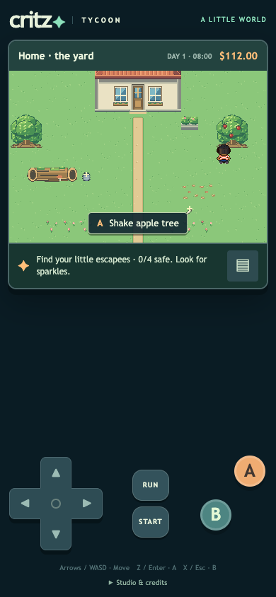
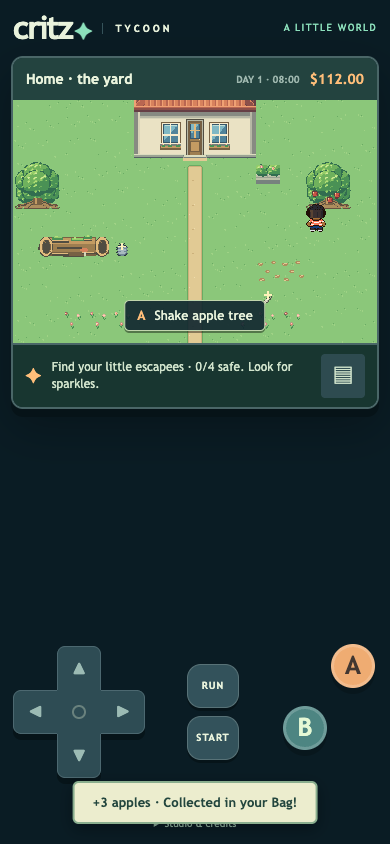
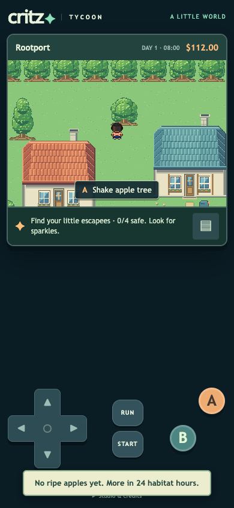
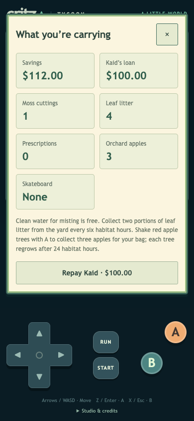

# M1.FR1 — Shakeable apple trees

Stand next to a red apple tree and press A / Z / Enter. Its crown shakes, three apples fall and bounce, and the pickup message confirms they are in your Bag. Empty trees tell you how many habitat hours remain. Each tree regrows independently after 24 saved habitat hours. Reloading cannot duplicate a harvest. Apples are collected items; no new food, health or selling effects are introduced.

| Place | Existing tree position | Stable ID |
| --- | --- | --- |
| Home yard | East side, `(13,3)` | `apple-yard` |
| Rootport | Behind the northwest cottage lane, `(10,3)` | `apple-rootport` |
| Mossway | Southwest woodland, `(3,26)` | `apple-mossway` |
| Liarsville | Beside the central garden area, `(16,20)` | `apple-liarsville` |

The same two-cell root footprints remain blocked. Both root cells support adjacent interaction; diagonal/distant shaking cannot grant fruit. Crown movement is only ±2 native pixels and never moves the roots or camera. Calm mode grants the same harvest with a message and no shaking/falling motion.

## Art and saves

Five appended native tiles hold the ripe 64×64 tree and apple pickup; the bare state reuses the existing rooted broadleaf assembly. [All 639 previous tiles remain exact](art-check.json). The master contains 644 named tiles in a 1024×1152 PNG. New original apple pixels use binary alpha, the existing native grid and stable IDs. [Authoring source](../../../art/source/overworld-live/build.mjs).

The existing v1 save keys and version remain unchanged. New `inventory.apples` and `fruitHarvests` fields are optional on older saves. Loading old data leaves absent fields untouched; first harvest adds only those fields. Quantities and known per-tree timestamps are validated, and harvest credit/time are saved together before feedback. Animation lives outside the save. The habitat clock controls regrowth; time spent with the game closed does not advance it. All existing story, gift, debt, care and Critter behavior is retained.

## Verification

[115 unit checks](unit-results.txt) and [nine fruit browser scenarios](report.json) pass. They cover all four trees, legacy save/reload, repeated presses, independent 24-hour regrowth, actual habitat ticks, invalid/remote attempts, inventory limits, Calm, readable Bag layout and missing assets/errors. [Renderer pixel proof](motion-proof.json) confirms crown movement with fixed roots/camera. Synthetic saves use fresh isolated contexts, never user browser storage. Phone screenshots inspected. The exact clean release repeats all 115 unit checks and nine fruit scenarios, plus [28 entrance scenarios](doors-report.json), [17 dialogue/contact scenarios](contact-report.json) and [all 17 story scenarios](story-report.json): 71 release browser scenarios total. Physical Safari is not claimed.

## Publication

[Play on your phone](https://critz-tycoon.freemarketwildlife.chatgpt.site). Source `089908ad3a21e0456483cbe66251381f4261bf00` is pushed to GitHub main and the Sites source repository. All **1,646 tested content files** match the archive exactly; only the hosting manifest is additional. [Archive verification](archive-check.json) · [Content hashes](tested-build-sha256.json). [Native deployment](deployment.json) succeeded at **2026-10-08 08:47:59 UTC**, preserving owner-private access and saves. This final documentation receipt needs no redundant deployment. User visual/motion feedback remains pending; no broader milestone is self-approved.
