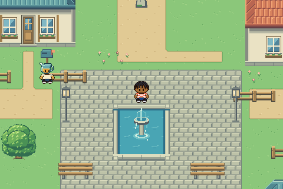
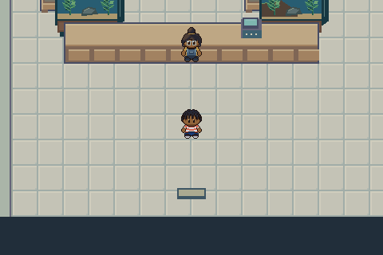
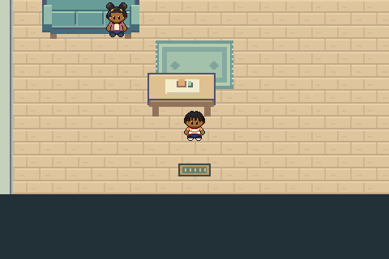
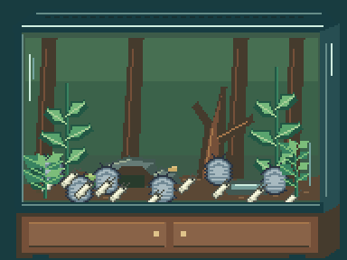

# M1.I4 — Living assets, thresholds and tank interface

The user explicitly authorized integrating the existing M1.C7 living collection into gameplay, requested Pokémon-like interior thresholds and day/night lighting, and requested an idle-only brief for any missing characters. This authorizes runtime integration of that collection; it does not self-approve new parent designs or final movement/appearance.

## What is playable

- Twelve native character sets: both Heroes, both opposite-gender rivals, Mom, Kaid, Nugget, Juniper, Dr. Fern, Mina, Ollie and Aunt Ember. Four-direction source poses feed the existing movement controller; run mode uses the authored walk poses at the controller’s existing faster cadence. Character pixels are drawn at their native size in the 480×320 world, not enlarged from the old sprites.
- All four rescue kinds use animated C7 art. Pebble and Button remain separately cared for at the Vet after rescue. The two missing parent designs retain their old art pending review.
- C7 terrarium world props replace intact home tanks. Aquarium and paludarium props furnish Glow n’ Blow. Existing furniture/interior tiles and the story’s broken-tank prop remain legacy assets because this collection does not replace them.
- Little Root uses separate terrarium back/foreground layers, native isopods/springtails and stateful moss, purchased hide, food, waste, algae and condensation. The close-up illustrates a sample of larger colonies; census values remain authoritative. Decorative plants baked into C7 layers are scenery; planted moss changes with the simulation.
- Manage / Stats / View remain the first controls. Pan, zoom, photo capture, simulated video, scores and Critter earnings remain active. New snapshots are 384×288, a nearest-neighbor 2× display of the 192×144 authored close-up; old saved snapshots remain unchanged. A small off-frame margin permits panning at the initial zoom. The responsive DOM controls remain readable and touch-sized.
- Living collection is accessible from the tank menu and Aunt Ember’s shop. All ten animated animal studies and three animated habitat designs appear there. Displays do not grant animals, alter stock, mix species or change the 25-gallon gift.
- Closed exterior entrances have indoor floor mats. Glow n’ Blow and the Waterworks have visibly open exterior doorways and daylight on the inside threshold. Daylight fades at dawn/dusk and vanishes at night, using the existing saved simulation hour. The opening’s night remains night regardless of its initial clock. Walking onto a door/exit cell triggers travel; the A interaction remains available.

## Missing character brief

**Rival’s mother and father** are the only current NPCs without living-collection-v1 character sets. [Ready-to-use agent prompt](MISSING-CHARACTERS-PROMPT.md): one south-facing idle frame each, native/export/editor/grid verification, user review before animation or runtime replacement. No new parent art or animation was created by this integration.

## Reference and original decisions

Inspected pinned Emerald source at `5eff78649e7170a877b961ef0b3da13b81a16038`, including [field_door.c](https://github.com/pret/pokeemerald/blob/5eff78649e7170a877b961ef0b3da13b81a16038/src/field_door.c) and [metatile_behavior.c](https://github.com/pret/pokeemerald/blob/5eff78649e7170a877b961ef0b3da13b81a16038/src/metatile_behavior.c). Door animation data and warp/door behavior are separate reference systems. This implementation does not claim to reproduce Emerald’s door animation timing or emulator behavior. Indoor mats, selected open entrances and the day/night palette are original Critz implementation decisions responding to this user request; the lighting is not attributed to Emerald.

The Bible retains the production dimensions and anatomy rules. `art/source/living-runtime/build.mjs` packs immutable C7 source frames into a separate runtime PNG without resampling. All 289 frame rectangles retain exact indexed RGBA and source ticks. Neither the old 24×32 work-in-progress atlas nor review GIF presentation palettes supply production pixels.

## Verification

- 83 relevant unit checks pass, including independent decoding of every packed atlas rectangle back to C7 indexed RGBA, identity mapping, source cadence mapping, clock/door rules, collision, saves and simulation.
- Original chapter browser regression passes all 17 checks: both loan paths, all rescues, shops, medicine, skateboard, hide, care, Critter photos/video, earnings and save/reload.
- [Integration browser receipt](browser-report.json) covers native choice previews, tank UI/census, ten animals and three animated habitat views, capture, daytime/night thresholds, real-input automatic exit, NPC/world props, phone widths, missing assets and every care visual without state mutation. Representative native world crops and phone screenshots are alongside this file.
- Browser contexts use synthetic saves. No personal browser storage is tested or overwritten. Phone-sized Chromium emulation is not physical iPhone/Safari testing. Technical checks do not constitute user visual/motion approval.

The shared working directory contains older, unrelated 24×32 character experiments and concurrent music work. These remain outside this delivery. Their stale untracked `appearance.test.mjs` expects a 24×32 atlas and fails against the pre-existing composite atlas; it is not imported by this runtime and is not included in the clean release. Task-related overlapping runtime preview/identity changes are superseded by the requested native integration.

Publication and exact next action are recorded in [PROJECT_STATUS](../../PROJECT_STATUS.md). Review the phone build and then create/review the two parent idles using the linked brief.
