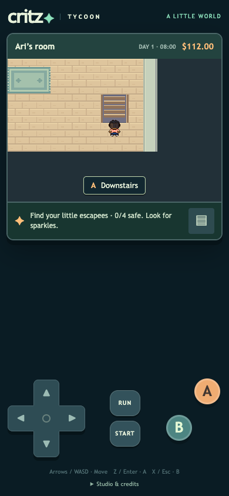
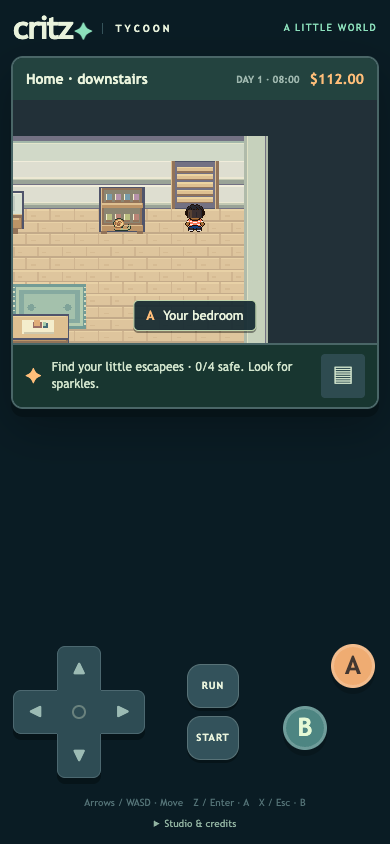

# M1.ST1 — One entrance per indoor staircase

The user rejected walking all over stairs and requested Emerald-style traversal. Both existing home staircases now have explicit solid rail/back cells around one entrance, reached by walking north from a clear south landing. Completing the entrance step triggers the existing scene fade. A remains a Critz accessibility shortcut only while standing on that landing and facing into the stairs; side/back interaction cannot bypass collision.

The bedroom stair assembly moves one cell north, leaving its south landing inside the room. Both floors place arrivals on the landing facing away from the entrance. During the opening, stairs remain visible and solid but travel remains story-locked. Existing native stair art is retained. There are no placed outdoor stair tiles in the current playable overworld; the spare master-sheet stair modules are unaffected.

Old saved positions in either stair footprint recover to the authored landing through the existing pure grid normalization. Save keys, schema, story flags, names, gift, loan, tank state and other progress stay unchanged. No reference art is shipped, and this fix does not self-approve the full movement milestone.

## Pinned reference inspection

Source revision: `pret/pokeemerald` **5eff78649e7170a877b961ef0b3da13b81a16038**. This is source/map-data inspection, not emulator frame capture.

- [Brendan’s 2F warp](https://github.com/pret/pokeemerald/blob/5eff78649e7170a877b961ef0b3da13b81a16038/data/maps/LittlerootTown_BrendansHouse_2F/map.json) is `(7,1)`. Decoding the corresponding [9×8 map words](https://github.com/pret/pokeemerald/blob/5eff78649e7170a877b961ef0b3da13b81a16038/data/layouts/LittlerootTown_BrendansHouse_2F/map.bin) gives entrance metatile `0x214`, collision 0; west/east/north neighbors `(6,1)/(8,1)/(7,0)` have collision 1. The south approach `(7,2)` has collision 0.
- [Brendan’s 1F warp](https://github.com/pret/pokeemerald/blob/5eff78649e7170a877b961ef0b3da13b81a16038/data/maps/LittlerootTown_BrendansHouse_1F/map.json) is `(8,2)`. Its [11×9 map words](https://github.com/pret/pokeemerald/blob/5eff78649e7170a877b961ef0b3da13b81a16038/data/layouts/LittlerootTown_BrendansHouse_1F/map.bin) give entrance metatile `0x211`, collision 0; west/east/north `(7,2)/(9,2)/(8,1)` have collision 1, and south `(8,3)` collision 0. Map-word masks are documented in [global.fieldmap.h](https://github.com/pret/pokeemerald/blob/5eff78649e7170a877b961ef0b3da13b81a16038/include/global.fieldmap.h).
- [Step-based warp handling](https://github.com/pret/pokeemerald/blob/5eff78649e7170a877b961ef0b3da13b81a16038/src/field_control_avatar.c#L483-L491) calls [warp-event handling](https://github.com/pret/pokeemerald/blob/5eff78649e7170a877b961ef0b3da13b81a16038/src/field_control_avatar.c#L702-L746); [object collision](https://github.com/pret/pokeemerald/blob/5eff78649e7170a877b961ef0b3da13b81a16038/src/event_object_movement.c#L4660-L4677) checks map collision, directional barriers, elevation and objects before movement.

Critz uses that single-entrance/solid-surround pattern. Its 3×2 logical footprint, room coordinates, existing 160ms scene fade, A shortcut and safe-save recovery are explicit Critz choices, not claims of identical Emerald animation/elevation behavior.

## Verification

[98 unit checks](unit-results.txt) pass, including seven new stair tests: both footprints, every approach direction, correct facing for A, completed-tile entry, safe arrival, all old positions in both footprints, nonposition save preservation and the opening story gate.

[Six isolated browser checks](report.json) pass with real input: rails and rear block movement, sideways A does not travel, both entrance steps complete before warping, no immediate return, A works from the correct landing, and an old stair save reloads safely with the 25-gallon gift and $100 debt intact. No missing assets or runtime errors. Physical iPhone/Safari testing and full reference animation equivalence are not claimed.

The exact clean release repeats all 98 unit and six stair-browser checks, and passes all [17 chapter scenarios](chapter-browser-report.json), including both loan choices, rescues, every shop, care, posts and save/reload. The unrelated pre-existing appearance test is outside the clean release; no unfinished character edits were included.

## Published build

[Play on your phone](https://critz-tycoon.freemarketwildlife.chatgpt.site). Source `8d0b57b29104b98cff03d758694b047a4f0ac336` is pushed to GitHub main and the Sites source repository. All **1,592 tested build files** match the archive exactly; its only addition is the hosting manifest. [Archive verification](archive-check.json) · [Content hashes](tested-build-sha256.json). [Native deployment](deployment.json) succeeded at **2026-10-08 07:51:49 UTC**, preserving the owner-private audience. Documentation receipts are committed separately without rebuilding the playable release. User traversal/feel feedback is the next review step; no implementation/publication work remains.
