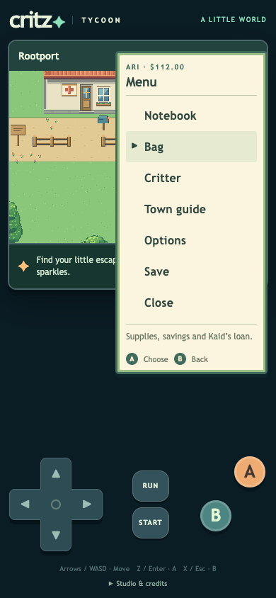
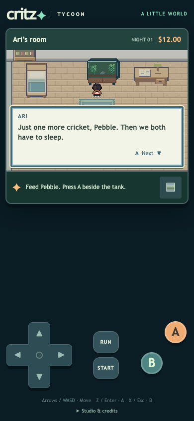
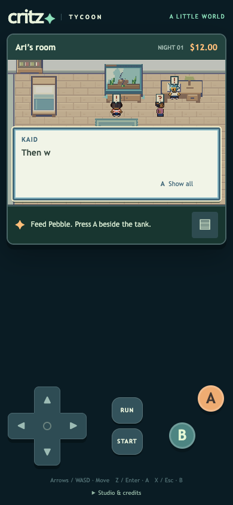

# M1.UI1 — Menus, fast dialogue and character life

The user authorizes simpler Gen 3-inspired UI, fast typed dialogue without a slow option, punctuation reactions, cutscene hops/looks and small NPC patrols. **Implemented, checked and published; user presentation/feel feedback pending.** This remains a playable presentation/feel deliverable for user feedback, not self-approved M1/M2 artwork or movement.

## Play it

Press **Start** for Notebook, Bag, Critter, Town guide, Options, Save and Close. One cursor follows ↑/↓ or the D-pad. A selects; B backs out. Submenus return to the menu with the selection remembered. The world remains visible behind the compact command window. Long care and shop screens retain readable, scrollable controls.

**Options** has Leaf, Ocean and Sunset window colors, a fast text preview and Lively/Calm reactions. Text is always Fast; there is no Slow setting. Options has Save & return to title during play. Preferences use a separate validated `critz-tycoon.ui.v1` key and honor reduced-motion preference by default. Game save keys/data stay unchanged.

Speech uses two-line pages and a continuation arrow. A/B while typing reveals the current page; a subsequent press advances. There are no artificial punctuation delays. Full pages are announced separately for screen readers, not character by character. Resize reflows unread text. Narrow-screen conversation framing leaves visible room above the message for the people and their reactions; this camera accommodation is an original Critz phone decision.

Nugget, Kaid and the rival patrol small routes in Rootport; Mom and Kaid also have small home routines. Other adults glance around while idle. NPCs pause near the player, reserve both ends of a step, wait for blocked destinations and stop during menus/dialogue. Speakers face the player. Exclamation/question balloons and short hops/looks punctuate greetings, questions and Kaid’s birthday gift. Distress uses restrained surprise, not celebratory hopping. Calm removes hops and reaction bobbing. Kaid’s night staging is moved beside the desk so the speech window does not hide him.

Kaid and the rival’s old outdoor anchors landed on fence art/collision. They now start one cell south on the path. Patrol footprints leave a connected path from every town doorway, even if all their route cells are treated as occupied. Actor positions, routes, cues and timers are transient, keyed to the active in-memory state; they never enter saved story progress and reset on scene re-entry. Existing NPC IDs, names, character pixels, rescues, shop actions and simulation remain intact.

## Reference evidence and Critz choices

Inspected original source at **pret/pokeemerald `5eff78649e7170a877b961ef0b3da13b81a16038`**, not a frame-captured emulator session:

- [menu.c](https://github.com/pret/pokeemerald/blob/5eff78649e7170a877b961ef0b3da13b81a16038/src/menu.c#L72-L101) supplies Fast=1 and the bottom standard text window. [text.c](https://github.com/pret/pokeemerald/blob/5eff78649e7170a877b961ef0b3da13b81a16038/src/text.c#L257-L324) decrements nonzero text speed before printing, so Fast removes the delay counter; ordinary glyphs print on successive source ticks. [Continuation handling](https://github.com/pret/pokeemerald/blob/5eff78649e7170a877b961ef0b3da13b81a16038/src/text.c#L808-L871) waits on A/B and animates an arrow. Critz uses the existing source tick, grapheme-safe text and immediate page reveal on A/B as an explicit convenience.
- [start_menu.c](https://github.com/pret/pokeemerald/blob/5eff78649e7170a877b961ef0b3da13b81a16038/src/start_menu.c#L298-L318) assembles a short list of field actions, including Bag, Save, Option and Exit; [cursor initialization](https://github.com/pret/pokeemerald/blob/5eff78649e7170a877b961ef0b3da13b81a16038/src/start_menu.c#L475-L483) retains the selected row. Critz’s seven entries serve its own ecosystem game; they are not copied Pokémon labels or functionality.
- [event_object_movement.c](https://github.com/pret/pokeemerald/blob/5eff78649e7170a877b961ef0b3da13b81a16038/src/event_object_movement.c#L225-L276) defines look-around and directional walking-sequence types. [field_effect.c](https://github.com/pret/pokeemerald/blob/5eff78649e7170a877b961ef0b3da13b81a16038/src/field_effect.c#L3257) uses a scripted jump-in-place action. Critz’s routes, waits, 8px/0.42s hop arc and original punctuation balloon pixels are new authored choices, not measured reproductions of Emerald effects.

No reference sprites, font bitmaps, recordings or UI art were copied. The warm paper frames and accessible DOM text are original; a complete pixel-font/interface conversion remains deferred as the user requested.

## Checks and limits

[Unit receipt](unit-results.txt): **91 checks pass**. New checks cover fast cadence across refresh rates, graphemes/page content, preferences isolated from save keys, all walkable/cardinal patrols, step reservations, player avoidance, conversation pause/facing, reaction expiry, calm behavior, state immutability and connected exits.

[UI browser receipt](browser-report.json) exercises real keyboard/touch input, remembered cursor, options/back navigation, fast reveal/advance behavior, question/exclamation/hop cues, three moving outdoor NPCs, conversation facing/pause, phone/landscape/desktop layout and missing asset/runtime errors. [Full chapter receipt](chapter-browser-report.json): all 17 existing story, shop, care, media, save and loan checks pass. The test walker now consults live NPC positions and avoids patrol footprints; it does not disable runtime NPC movement.

The first patrol draft could block the single path below Kaid’s gate. It was replaced and a connectivity assertion added. Initial deferred menu focus could lose an immediate direction press; synchronous focus fixes it. Reaction animation continues during dialogue while locomotion freezes, and tests distinguish these two behaviors. Screenshots at 320/390/844/1280 CSS pixels were inspected. Small panels can scroll; 44px confirmation controls remain reachable.

All browser work uses isolated synthetic saves. Physical iPhone/Safari testing and emulator frame equivalence are not claimed. The unrelated untracked 24×32 appearance test remains outside this clean task/release. Existing unfinished character files are preserved. User play/feel feedback is the next review step after publication.

## Publication

[Play on your phone](https://critz-tycoon.freemarketwildlife.chatgpt.site). Source `56874e496a199d74efaf2a5771f54a7b331651cd` is pushed to GitHub main and the Sites source repository. The exact clean release repeats all 91 unit, 8 UI and 17 chapter checks above. [Archive verification](archive-check.json) confirms every one of the 1,584 [tested content hashes](tested-build-sha256.json) matches the deployment package; the hosting manifest is its only addition. [Native deployment](deployment.json) succeeded at 2026-10-08 07:32:27 UTC with the existing owner-private audience. This publication receipt is documentation only; the live playable source is unchanged by it.
