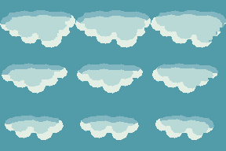

# M1.WA4 — Water corner correction and reflected sunny clouds

[Phone demo](https://critz-tycoon.freemarketwildlife.chatgpt.site/art-review/water.html) · [Corrected transition gallery](https://critz-tycoon.freemarketwildlife.chatgpt.site/art-review/water-tiles.html).

The screenshot exposes the inside-corner error: a rounded eight-pixel notch met a straight shoreline inset of five pixels. The three-pixel mismatch made land tongues and water joins disagree across cells. Both the source tileset generator and runtime water/reflection clipping now use matching five-pixel geometry. Exhaustive testing of every shared edge in65,536 four-by-four layouts changes884,736 mismatched pixel comparisons to zero. All6,648 stable IDs/coordinates and all256 surface-animation frames remain unchanged. Rebuild the complete bank rather than swapping one demo corner manually.

Clouds now have three original hand-drawn stepped silhouettes, three opaque colors and binary alpha. Author upright96×64 frames and vertically invert them when rendering reflections, leaving east/right and west/left unchanged. Broad palette clusters follow the clock: light from the right at10am, overhead at noon and leftward before3pm. There are301 minute-specific lighting frames per silhouette,903 total; the change in lighting is gradual and independent of cloud drift. The light-study image below shows10am, noon and2:59pm in columns; silhouettes occupy rows.

Clouds appear only when review weather is Sunny and **10:00am ≤ time <3:00pm**. Use the new10am/2:59pm/3pm controls, minute slider and Sunny/Overcast/Rain selector to compare. Weather selection is disposable demo state; it does not invent a main-game weather schedule or alter saves. Night stars, freshwater-only actor reflection, shallow-only walking, still-shallow footsteps, independent shadows, Calm, wildlife, minute clock and2am sleep remain. New visuals remain review art.

## Reference facts and limits

Pinned pret/pokeemerald revision `5eff78649e7170a877b961ef0b3da13b81a16038`. [Cloud PNG](https://github.com/pret/pokeemerald/blob/5eff78649e7170a877b961ef0b3da13b81a16038/graphics/weather/cloud.png) is64×64 with five occupied nonzero palette indices; index0 is object transparency. [Cloud OAM/map placement](https://github.com/pret/pokeemerald/blob/5eff78649e7170a877b961ef0b3da13b81a16038/src/field_weather_effect.c#L40-L71) uses blended objects at priority3; its callback moves left. The supplied pond screenshot and source sprite inform broad lobes, restrained colors and reflected orientation. Our shapes, smaller96×64 frame, three-color palette and time-changing highlights are original Critz adaptations. In particular, we did not verify a time-of-day directional cloud-lighting system in Emerald; the user requests that behavior for Critz. Proposed solar arc treats6am as eastern horizon, noon as overhead and6pm as western horizon, without claiming geographic/seasonal astronomy. Source inspection and user screenshots are not our own emulator observation. Reference pixels are not shipped.

## Verification

Clean task-only export passes182 unit tests, including exhaustive corner continuity and sunny/hour/solar-boundary tests. Eight new isolated browser scenarios cover actual cloud loading,9:59/10:00/noon/2:59/3:00 views, weather suppression, east/west progression, Calm, gallery, phone overflow and runtime errors. Existing water and clock/sleep regressions pass. Final combined release preserves concurrent contact correction and passes182 unit tests and48 browser scenarios. All2,036 build files match the deployment archive. Version38 is published successfully from `269533d79dee6922b6d70dc4277174412db0cc50`. Final Calm verification runs with the simulation unpaused; the follow-up changes only its test harness and receipts, preserving the hosted runtime. Native checks verify exactly three cloud colors, binary alpha,903 frames, stable terrain metadata and unchanged water-animation pixels. Screenshots inspected; physical Safari remains unverified. Existing character edits are preserved and excluded. Final commit/push/deployment evidence is in PROJECT_STATUS and receipts alongside this file.
